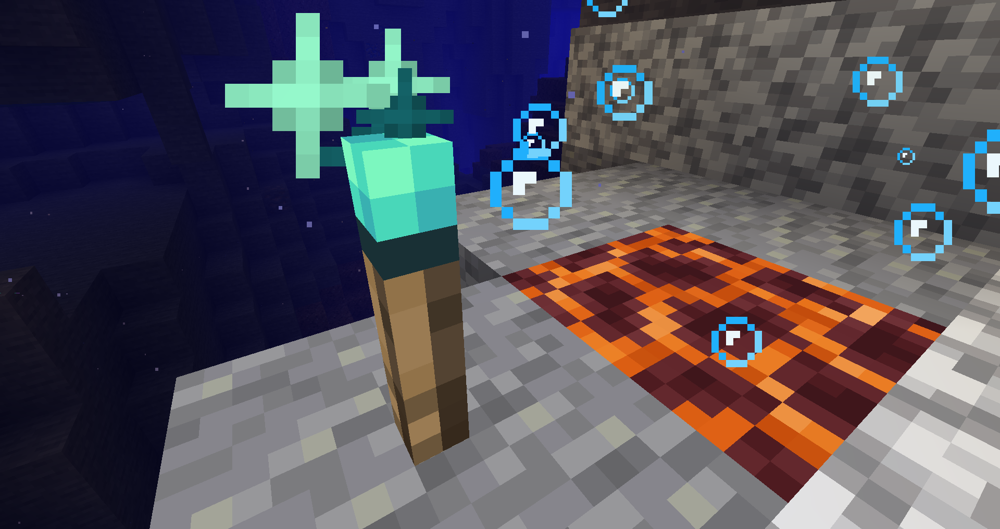
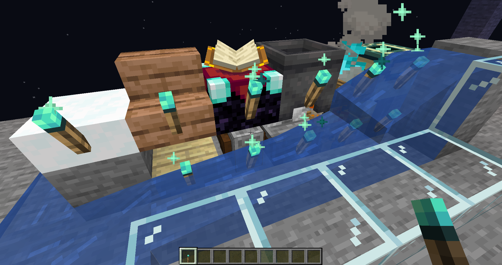

# 荧光墨汁火把
荧光墨汁火把是一种可以可以在水中提供亮光的非固体方块。

## 生成

荧光墨汁火把不会自然生成在世界中。

## 获取

荧光墨汁火把只能合成而来。

## 破坏

荧光墨汁火把被挖掘时会立刻被破坏，掉落自身。

## 用途

荧光墨汁火把必须放置于方块[中心完整](https://zh.minecraft.wiki/w/方块支撑形状)的上表面上方或方块侧面从左下(6,3)到右上(10,7)内全部完整的固体表面，不过有个别的需要潜行放置（例外情况见[放置](https://zh.minecraft.wiki/w/火把#放置)）。

当流动的[水](https://zh.minecraft.wiki/w/水)流过荧光墨汁火把的位置，水会填充火把所在的位置。荧光墨汁火把可以直接放在水中。

其余特性与[原版火把](https://zh.minecraft.wiki/w/火把#用途)相同。

### 照明

荧光墨汁火把会发出[亮度](https://zh.minecraft.wiki/w/亮度)为14级的光。

## 音效
与[原版](https://zh.minecraft.wiki/w/%E7%81%AB%E6%8A%8A#%E9%9F%B3%E6%95%88)相同。
## 配置
- 是否能被熔岩冲毁。
- 亮度等级。
## 数据值
### ID
| 名称     | [命名空间ID](https://zh.minecraft.wiki/w/命名空间ID) | [方块标签](https://zh.minecraft.wiki/w/标签#方块)（[JE](https://zh.minecraft.wiki/w/Java版)） | [物品标签](https://zh.minecraft.wiki/w/标签#物品)（[JE](https://zh.minecraft.wiki/w/Java版)） | 拥有物品形式 | 本地化键名                                 |
|--------|----------------------------------------------|------------------------------------------------------------------------------------|------------------------------------------------------------------------------------|--------|---------------------------------------|
| 荧光墨汁火把 | torches_in_water:glow_ink_torch              | wall_post_override                                                                 | 无                                                                                  | 是      | block.torches_in_water.glow_ink_torch |
### 方块状态
<table>
<tr><th>方块</th><th>方块属性</th><th>默认值</th><th>接受值</th><th>描述</th></tr>
<tr><td rowspan="22">荧光墨汁火把</td><td rowspan="5">facing</td><td rowspan="5">down</td><td>down</td><td>所依附方块在火把的下方</td></tr>
<tr><td>north</td><td>所依附方块在火把的北方</td></tr>
<tr><td>south</td><td>所依附方块在火把的南方</td></tr>
<tr><td>west</td><td>所依附方块在火把的西方</td></tr>
<tr><td>east</td><td>所依附方块在火把的东方</td></tr>
<tr><td rowspan="17">level</td><td rowspan="17">16</td><td>0</td><td>水源</td></tr>
<tr><td>1</td><td rowspan="15">水的等级，与原版的<a href="https://zh.minecraft.wiki/w/%E6%B0%B4#%E6%96%B9%E5%9D%97%E7%8A%B6%E6%80%81">水</a>相同</td></tr>
<tr><td>2</td></tr>
<tr><td>3</td></tr>
<tr><td>4</td></tr>
<tr><td>5</td></tr>
<tr><td>6</td></tr>
<tr><td>7</td></tr>
<tr><td>8</td></tr>
<tr><td>9</td></tr>
<tr><td>10</td></tr>
<tr><td>11</td></tr>
<tr><td>12</td></tr>
<tr><td>13</td></tr>
<tr><td>14</td></tr>
<tr><td>15</td></tr>
<tr><td>16</td><td>没有流体</td></tr>
</table>

## 历史
<table>
<tr><th>0.1.0</th><td>加入了荧光墨汁火把。</td></tr>
<tr><th rowspan="3">0.2.0</th><td>可以设置荧光墨汁火把的亮度。</td></tr>
<tr><td>荧光墨汁火把的纹理现在是动画。</td></tr>
<tr><td>荧光墨汁火把的产物数量由1改为4。</td></tr>
<tr><th>0.2.1</th><td>移除了荧光墨汁火把的工具提示。</td></tr>
<tr><th>0.2.2</th><td>对着方块下表面放置荧光墨汁火把不再崩溃。</td></tr>
</table>

## 你知道吗

- 此方块灵感来源于[《Aquatic Torches》](https://www.mcmod.cn/class/6522.html)中的Aquatic Torch。
## 画廊

